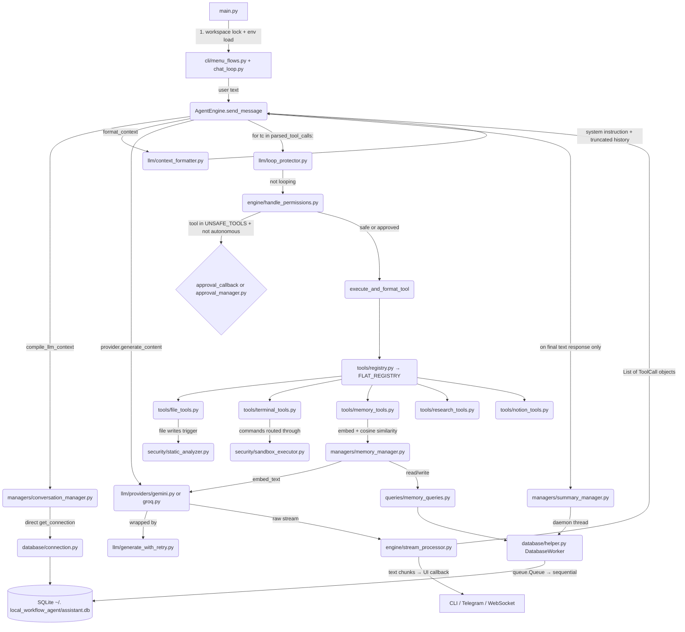

# GEMINI Codebase Navigation & Deep Context Guide

## 1. System Map & Execution Flow

## 2. Core Execution Engine (`engine/`)

*   **`agent_engine.py`** — the `while True` ReAct loop inside `send_message()`
    *   **Step 1:** calls `compile_llm_context(conversation_id)` to get the message history from SQLite (this goes through `conversation_manager.py` which calls `get_connection()` **directly**, not through `DatabaseWorker`)
    *   **Step 2:** passes the history to `self.provider.generate_content()` which returns a generator stream
    *   **Step 3:** feeds the stream to `process_llm_stream()` which returns `(full_text, parsed_tool_calls, prompt_tokens, comp_tokens)`
    *   **Step 3.5 (Token Fallback):** if `prompt_tokens` or `comp_tokens` are 0, calls `calculate_fallback_tokens()` which uses a `chars / 3.7` heuristic plus a `50 * num_tool_calls` buffer
    *   **Step 4:** logs token usage via `log_api_usage()`
    *   **Step 5 (Per-Tool Loop):** if `parsed_tool_calls` is non-empty, iterates with `for tool_call in parsed_tool_calls:` — calling `check_for_infinite_loop()` first, then `determine_and_execute_tool()`, then appending the formatted result to `db_messages` and `continue`-ing the while loop
    *   **Step 6:** if no tool calls, saves the final text, fires `trigger_background_summary()`, and returns
    *   **Key detail:** `tool_call_history` is a local list that lives for the duration of one `send_message()` call. It accumulates `{"name", "args_json", "status", "paths"}` dicts. The loop protector only checks **consecutive identical entries from the tail** (it iterates `reversed()` and `break`s on first mismatch)
    *   **Constructor:** resolves API keys from env vars using a hardcoded `env_var_map = {"gemini": "GEMINI_API_KEY", "groq": "GROQ_API_KEY"}`

*   **`handle_permissions.py`** — the security routing layer
    *   **`determine_and_execute_tool()`** checks if `tool_name in UNSAFE_TOOLS` (defined in `cli/security_rules.py` as `{"run_script", "manage_dependencies", "write_files", "edit_file_chunk"}`) AND `autonomous == False`
    *   If unsafe: calls `approval_callback(tool_name, tool_args, conversation_id)` — this is a **synchronous blocking call**. The engine thread freezes until the callback returns `True`/`False`
    *   If no callback provided: returns an error immediately
    *   If approved or safe: delegates to `execute_and_format_tool()` which calls `registry.execute_tool()`, classifies success/error via `_detect_tool_error()`, logs via `log_tool_run()`, and unwraps structured dicts via `_extract_display_output()`
    *   **`_detect_tool_error()` priority chain:**
        1.  `dict` with `"status"` key in `("success", "error")` → trust it directly (used by `sandbox_executor.py` return format)
        2.  `dict` with top-level `"error"` key → treat as failure
        3.  `dict` from `read_files`/`write_files` → check per-path values for `"Error:"` string prefix
        4.  `str` → check if it starts with `"Error:"`

*   **`stream_processor.py`** — consumes the LLM generator stream
    *   Maintains a `tool_buffer` dict keyed by tool call ID
    *   Text chunks: immediately forwarded to `send_message_callback` for real-time UI streaming
    *   Tool call deltas: `arguments` string fragments are concatenated silently, then batch-parsed into `ToolCall` objects via `json.loads()` after the stream ends
    *   If JSON parsing fails: logs a warning and falls back to `{}` args (lets the tool execution handle missing params gracefully)
    *   Token counts extracted from `chunk.prompt_tokens` / `chunk.completion_tokens` fields

*   **`thinking_configure.py`** — Gemini 3.x / Gemma 4 thinking mode
    *   `supports_thinking()` checks if model name starts with `"gemini-3"` or `"gemma-4"`
    *   Returns `types.ThinkingConfig` with Low/Medium/High levels, with fallback to string enums if SDK version differs

## 3. LLM Abstraction & Protection (`llm/`)

*   **`schemas.py`** — shared data contracts used across the entire pipeline
    *   `ToolCall(name, args, id, metadata)` — standardized tool call representation
    *   `LLMResponse(text, tool_calls, prompt_tokens, completion_tokens, raw_output)` — provider return type
    *   `StreamChunk(text, tool_call_deltas, is_finished, prompt_tokens, completion_tokens)` — streaming chunk type

*   **`provider_factory.py`** — `LLMFactory.get_provider()` maps `"gemini"` → `GeminiProvider`, `"groq"` → `GroqProvider`
    *   To add a new provider: subclass `BaseLLMProvider`, implement `format_messages()`, `generate_content()`, `embed_text()`, add the mapping here

*   **`base_provider.py`** — abstract base class with three required methods:
    *   `format_messages(db_messages)` → provider-specific format
    *   `generate_content(messages, tools, system_instruction, **kwargs)` → `LLMResponse`
    *   `embed_text(texts)` → `List[List[float]]` (vector embeddings for the memory system)

*   **`generate_with_retry.py`** — generic retry wrapper used by all providers
    *   Accepts `request_fn` (the actual API call) and `is_quota_error_fn` (classifier)
    *   **Normal errors:** exponential backoff (`base_delay * 2^attempt`), configurable max attempts (default 3)
    *   **429/Quota errors:** special path with `base_delay * 3.0` wait, then exactly one recovery retry. If that also fails with a quota error, raises `RuntimeError("Daily quota limit...")`
    *   **Empty responses:** treated as retryable failures
    *   `is_quota_error()` helper checks exception string/class for signals: `"resourceexhausted"`, `"429"`, `"quota"`, `"ratelimit"`, `"limit exceeded"`

*   **`loop_protector.py`** — evaluates tool call history for consecutive identical patterns
    *   Iterates `reversed(tool_call_history)`, counting consecutive entries matching `(tool_name, serialized_args)`. Breaks on first mismatch — so it only catches **back-to-back** repeats, not scattered duplicates
    *   Thresholds loaded from `config_manager.get_loop_guard()`: `max_failed_attempts` (default 3), `max_success_attempts` (default 2)
    *   `_extract_paths()` pulls file paths from `write_files` and `read_files` tool args for path-level tracking

*   **`context_formatter.py`** — the most behavior-critical file
    *   **`DEFAULT_SYSTEM_INSTRUCTION`**: ~170 lines defining the agent's identity, environment description, safety rules, working scratchpad protocol, research workflow, thinking/planning requirements, batching instructions, toolkit documentation, workspace discipline, memory protocol, failure/retry behavior, and communication style
    *   **`format_context()`**: extracts system instruction (custom or default), appends live IST timestamp, processes `system` role messages as summaries, and applies the "one-turn rule" — old tool outputs get truncated via `smart_truncate_tool_output()`
    *   **`smart_truncate_tool_output()`**: if content > 2000 chars, tries JSON parsing first (truncates per-key for dicts), then falls back to Head(5 lines)/Tail(5 lines) + file skeleton (via `tools/skeleton_parser.py`)

## 4. Tool Registry & Actuation (`tools/`)

*   **`core.py`** — defines the `@agent_tool` decorator. Sets `func.__is_agent_tool__ = True`. That's it — the rest is handled by the registry scanner

*   **`registry.py`** — two registries:
    *   `FLAT_REGISTRY`: `{tool_name: func}` dict for O(1) execution lookup
    *   `GROUPED_REGISTRY`: `{module_name: {"description": ..., "tools": {...}}}` for future routing/categorization
    *   `_load_all_tools()` runs once at import time via `pkgutil.iter_modules`, skipping `core.py`, `registry.py`, and anything starting with `security`
    *   `execute_tool()` uses `inspect.signature()` to dynamically inject `conversation_id` if the tool's signature has that parameter

*   **Available tool modules:**
    *   `file_tools.py` (20KB) — `read_files`, `write_files`, `get_file_skeletons`, `read_file_chunks`, `search_inside_files`, `edit_file_chunk`, `generate_pdf`, `read_pdf`
    *   `terminal_tools.py` — `run_script` (python/node only), `manage_dependencies` (pip/npm), `run_tests` (pytest/npm). All route through `sandbox_executor.py`
    *   `memory_tools.py` — `remember_user_preferences`, `search_user_histories`. Front-end for `memory_manager.py`
    *   `research_tools.py` — `web_researcher` (two-step: `action="search"` then `action="read"`)
    *   `notion_tools.py` — Notion API integration
    *   `skeleton_parser.py` — generates structural skeletons of source files (used by context_formatter for truncation, not an agent tool)

## 5. Security & Isolation (`security/`)

*   **`sandbox_executor.py`** (`LocalSandboxExecutor`)
    *   Constructor takes `sandbox_root`, creates `.venv` inside it on first run via `venv.create()`
    *   `run_command(command_list)`: `subprocess.run()` with `shell=False`, `cwd=self.sandbox_root`
    *   **Venv interception:** if `command[0]` is `python`/`python3`/`pip`/`pip3`, rewrites to `.venv/Scripts/{name}.exe` (Windows) or `.venv/bin/{name}` (Unix)
    *   Returns structured `{"status": "success"|"error", "output": "..."}` — this is the format that `_detect_tool_error()` in handle_permissions trusts directly (priority 1)
    *   Default timeout: 15 seconds

*   **`static_analyzer.py`** — scans **file contents being written**, NOT terminal commands
    *   **Python (`.py`, `.pyw`):** full AST analysis via `PythonSecurityVisitor`
        *   Blocked imports: `os`, `subprocess`, `pty`, `shutil`, `socket`, `requests`, `urllib`, `sys`
        *   Blocked calls: `eval`, `exec`, `__import__`, `input`, `compile`
        *   Handles both `import X` and `from X import Y` patterns, plus direct and attribute calls
    *   **Other languages (`.js`, `.ts`, `.c`, `.cpp`, `.h`, `.java`, `.rs`, `.sh`):** pre-compiled regex signatures detecting dangerous patterns (`child_process`, `system()`, `exec()`, `rm -rf`, `curl`, etc.)
    *   Max scan size: 2MB. Unmonitored extensions (`.txt`, `.md`, `.json`) pass through safely
    *   Returns `(is_safe: bool, reason: str | None)`

## 6. State & Memory Management (`managers/`)

*   **`conversation_manager.py`** — the primary context compiler
    *   `compile_llm_context()`: fetches summary (if exists) + raw messages after the last summarized message ID. Uses **direct `get_connection()` calls**, not the DatabaseWorker queue
    *   **Sliding window trimming:** if estimated tokens (via `tiktoken` cl100k_base, with `len // 4` fallback) exceed `max_context_tokens`, pops oldest messages one by one. Preserves the summary card at index 0 and protects the first user message. When removing an assistant message with `tool_calls`, also removes its trailing `tool` role messages to keep the conversation coherent
    *   `save_user_message()`, `save_assistant_message()`: route through `queries/message_queries.py`
    *   `log_api_usage()`, `log_tool_run()`: route through `queries/model_usage_queries.py` and `queries/tool_log_queries.py`

*   **`summary_manager.py`** — background conversation compression
    *   `trigger_background_summary()` spawns a **daemon thread** that:
        1.  Fetches un-summarized messages via `execute_read()` (through DatabaseWorker)
        2.  Checks against `config_manager.get_summary_trigger_count()` threshold
        3.  Sends old summary + new messages to the LLM with a "compress to 300 words" prompt
        4.  Saves the result via `create_or_update_summary()` with the latest message ID as the watermark
    *   This is **the primary reason `DatabaseWorker` exists** — this thread runs concurrently with the main conversation thread

*   **`memory_manager.py`** — vector-based semantic memory
    *   `save_semantic_memory(content, suggested_category)`:
        1.  Batch-embeds both content and category in a single `embed_text()` call
        2.  Compares category vector against all existing category blocks via cosine similarity
        3.  If best match score ≥ `similarity_threshold` → uses existing category; otherwise creates new block
        4.  Saves memory with its embedding vector
    *   `retrieve_semantic_memory(query_text, category, limit)`:
        1.  Embeds the category to find the best category block
        2.  Embeds the query text
        3.  Pulls all memories in that block, ranks by cosine similarity, returns top `limit`
    *   Uses a dedicated embedding provider (may differ from the chat provider) via `config_manager.get_default_embedding_provider()`

*   **`approval_manager.py`** — async UI approval system (separate from `handle_permissions.py`'s callback)
    *   `wait_for_decision(conversation_id, timeout=300)`: creates a `threading.Event`, stores it in `active_approvals` dict, calls `event.wait()` — freezing the engine thread
    *   `resolve_decision(conversation_id, approved)`: called by async UIs (Telegram, WebSocket) to set the approval boolean and call `event.set()` to unfreeze

*   **`user_manager.py`** — user registration with strict character whitelisting (alphanumeric + `_-;`, 1-25 chars)

## 7. Database Layer (`database/` + `queries/`)

*   **`connection.py`**: SQLite at `~/.local_workflow_agent/assistant.db`, WAL journal mode, foreign keys ON, `Row` factory
*   **`helper.py`**: `DatabaseWorker(threading.Thread)` with `queue.Queue`. Each task is a tuple of `(query, params, fetch_one, is_write, reply_queue)`. The worker runs a `while not stop_event.is_set()` loop with 0.5s poll timeout. Callers block on a per-request `reply_queue` with 5s timeout
*   **`queries/`**: 7 query modules — `conversation_queries`, `message_queries`, `summary_queries`, `memory_queries`, `model_usage_queries`, `tool_log_queries`, `user_queries`

## 8. CLI Layer (`cli/`)

*   `menu_flows.py` (21KB) — main application menu, model selection, configuration flows
*   `chat_loop.py` (13KB) — the interactive conversation loop that instantiates `AgentEngine` and provides the callbacks
*   `callbacks.py` — UI callback implementations for streaming and approval
*   `constants.py` — display constants and formatting
*   `security_rules.py` — defines `UNSAFE_TOOLS` set

## 9. Configuration (`utils/` + `config_configure/`)

*   `utils/config_manager.py` — reads YAML config for max turns, context tokens, loop guard thresholds, API retry settings, summary trigger counts, system instruction overrides, embedding provider settings
*   `utils/path_helper.py` — `.env` file loading and path resolution
*   `config_configure/in_chat_config.py` — runtime config changes during active chat
*   `config_configure/out_chat_config.py` — config changes from the main menu

## 10. Quick Navigation Guide for Agents

*   **Debugging a stuck loop:** check `llm/loop_protector.py` thresholds and the `tool_call_history` accumulation in `engine/agent_engine.py` lines 166-173
*   **Debugging API failures:** check `llm/generate_with_retry.py` for retry logic and `is_quota_error()` signal detection
*   **Adding a new tool:** write function in `tools/`, decorate with `@agent_tool` from `tools/core.py`. No other registration needed
*   **Adding a new LLM provider:** subclass `BaseLLMProvider`, implement 3 methods, add mapping in `provider_factory.py`
*   **Changing agent behavior/personality:** edit `DEFAULT_SYSTEM_INSTRUCTION` in `llm/context_formatter.py`
*   **Investigating DB concurrency issues:** check if the code path uses `get_connection()` directly (no queue protection) or `execute_read/write` from `helper.py` (queue protected)
*   **Understanding the approval flow:** `handle_permissions.py` for sync callbacks, `approval_manager.py` for async thread-freezing
