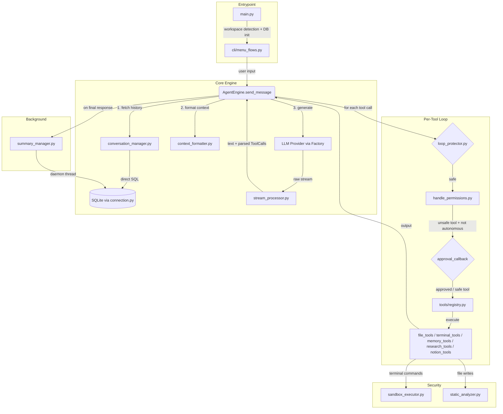

# Local Workflow Agent

A local-first, autonomous AI agent framework that executes dynamic workflows through a ReAct (Reasoning and Acting) loop. It interacts with the host filesystem, runs sandboxed commands, maintains vector-based semantic memory, and protects the host environment through layered security.

## Architecture



### Agent Engine (`engine/agent_engine.py`)
The orchestrator of the ReAct loop.
* Compiles conversation context from SQLite, queries the LLM provider, and processes the streamed response through `stream_processor.py`.
* If the LLM requests tool calls, the engine iterates over each one sequentially — checking the loop protector, routing through permissions, executing the tool, and feeding the output back into the next LLM turn.
* Calculates token fallbacks using a `chars / 3.7` heuristic when provider APIs drop usage metadata from the stream.
* On final text response, triggers a background summary thread to compress conversation history without blocking the user.

### Loop Protector (`llm/loop_protector.py`)
Prevents runaway token burning by evaluating tool call history inside the ReAct loop.
* Checks for **back-to-back consecutive identical calls** (same tool name + same serialized JSON arguments).
* Halts execution if a tool fails consecutively (default: 3) or succeeds consecutively (default: 2). Thresholds are configurable via `config_manager`.
* Also extracts file paths from `write_files` / `read_files` arguments for path-level deduplication tracking.

### Permission & Callback System (`engine/handle_permissions.py`)
The security routing layer between the LLM's requested tool and actual execution.
* Tools listed in `UNSAFE_TOOLS` (`run_script`, `manage_dependencies`, `write_files`, `edit_file_chunk`) trigger a pause when the agent is not in autonomous mode.
* The engine calls the injected `approval_callback(tool_name, tool_args, conversation_id)` and blocks until it returns `True` or `False`.
* For async UIs (Telegram, WebSocket), `managers/approval_manager.py` provides a thread-freezing alternative using `threading.Event` — the engine thread sleeps until the UI calls `resolve_decision()`.
* Classifies tool output as success/error through a priority chain: structured `{"status", "output"}` dicts → top-level `"error"` key → per-path `"Error:"` prefix → flat string prefix.

### Stream Processor (`engine/stream_processor.py`)
Consumes the raw LLM generator stream and splits it into text and tool calls.
* Text chunks are forwarded instantly to the UI callback for real-time display.
* Tool call argument fragments are silently buffered in a dict keyed by call ID, then parsed into `ToolCall` objects (defined in `llm/schemas.py`) once the stream ends.
* Extracts token usage from the final stream chunks when provided.

### Context Formatting (`llm/context_formatter.py`)
The largest and most behavior-critical file in the LLM layer.
* Contains the full `DEFAULT_SYSTEM_INSTRUCTION` — the agent's identity, safety rules, workspace discipline, memory protocol, thinking/planning workflow, and batching instructions.
* Injects a live IST timestamp on every turn so the model reasons from real-time.
* Implements `smart_truncate_tool_output()`: large tool outputs are compressed to Head/Tail snippets with auto-generated file skeletons (via `tools/skeleton_parser.py`). Only the most recent tool output is kept at full size (the "one-turn rule").

### LLM Provider Abstraction (`llm/`)
* **`base_provider.py`** defines the abstract contract: `format_messages()`, `generate_content()`, and `embed_text()`.
* **`provider_factory.py`** maps `"gemini"` → `GeminiProvider` and `"groq"` → `GroqProvider`.
* **`generate_with_retry.py`** wraps every API call with exponential backoff, 429/quota error detection, and configurable retry limits.
* **`thinking_configure.py`** manages Gemini 3.x / Gemma 4 thinking mode (Low/Medium/High levels).
* **`schemas.py`** defines the shared data contracts: `ToolCall`, `LLMResponse`, `StreamChunk`.

### Thread-Safe Database (`database/`)
* **`connection.py`** manages the SQLite connection. The database lives at `~/.local_workflow_agent/assistant.db` with WAL journaling and foreign keys enabled.
* **`helper.py`** provides a `DatabaseWorker` daemon thread with a `queue.Queue` — all reads and writes routed through it are serialized to prevent `database is locked` errors under concurrent load (e.g., background summaries running while the user fetches history).
* **`table_generator.py`** handles schema creation on startup.
* **Note:** Not all database access goes through `DatabaseWorker`. The `conversation_manager.py` uses `get_connection()` directly for context compilation. The worker is primarily used by the `queries/` modules and the summary manager.

### Security Layer (`security/`)
* **`sandbox_executor.py`** enforces `cwd` to the workspace root for all `subprocess.run` calls with `shell=False`. Intercepts `python`, `python3`, `pip`, `pip3` in command arrays and rewrites them to use the `.venv` binaries inside the sandbox.
* **`static_analyzer.py`** scans **file contents being written** (not commands). Uses Python AST analysis for `.py`/`.pyw` files (blocking `os`, `subprocess`, `eval`, `exec`, etc.) and pre-compiled regex signatures for `.js`, `.ts`, `.c`, `.cpp`, `.java`, `.rs`, `.sh` files.

### Tool Registry (`tools/`)
* **`registry.py`** dynamically scans `tools/` at startup using `pkgutil.iter_modules`. Functions decorated with `@agent_tool` (from `tools/core.py`) are cached in `FLAT_REGISTRY` for O(1) lookup. `execute_tool()` uses `inspect.signature` to dynamically inject `conversation_id` when a tool's signature requires it.
* **Available tool modules:** `file_tools.py`, `terminal_tools.py`, `memory_tools.py`, `research_tools.py`, `notion_tools.py`.

### Semantic Memory (`managers/memory_manager.py`)
A full vector embedding system for persistent cross-session memory.
* Embeds both memories and categories using the active LLM provider's `embed_text()`.
* Uses cosine similarity to match incoming memories to existing category blocks or create new ones on topic drift.
* Retrieval queries embed the search text, find the best category, then rank memories within that block by similarity.

## Extensibility

* **Adding a new LLM provider:** Subclass `BaseLLMProvider` in `llm/providers/`, implement `format_messages()`, `generate_content()`, and `embed_text()`, then add the mapping in `LLMFactory.get_provider()`.
* **Adding a new tool:** Write a function in any file inside `tools/`, decorate it with `@agent_tool`, and the registry auto-discovers it on startup — no registration code needed.

## Testing
The `tests/` directory contains **32 test suites** covering:
* **Engine:** ReAct loop limits, retry logic, stream processing, thinking configuration
* **LLM:** Loop protector, context formatting, Groq schema validation, provider integration
* **Tools:** File tool edge cases, terminal tools, registry, research tools, Notion tools
* **Database:** Connection, queries, queue concurrency
* **Managers:** Approval, conversation context, memory (including edge cases), summary generation flow
* **Security:** Sandbox executor, static analyzer

## Getting Started
```bash
pip install -r requirements.txt
python main.py
```
The system detects your current directory, initializes the database at `~/.local_workflow_agent/assistant.db`, and launches the CLI interface.
